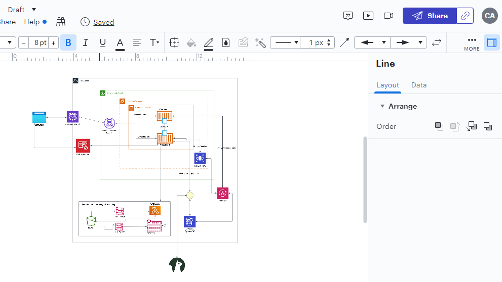
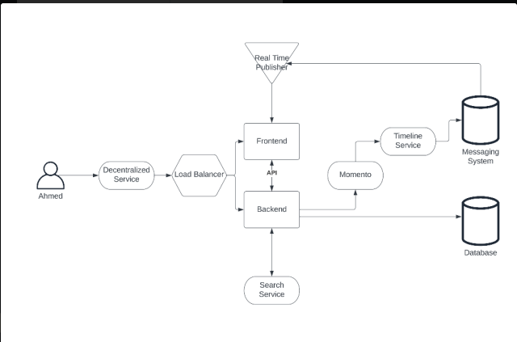
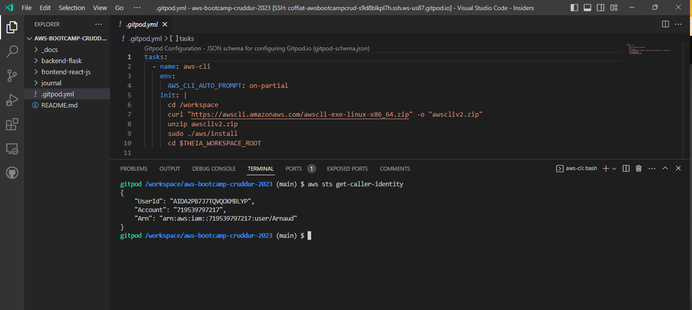
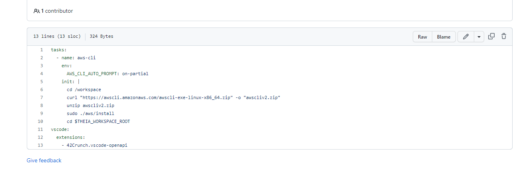
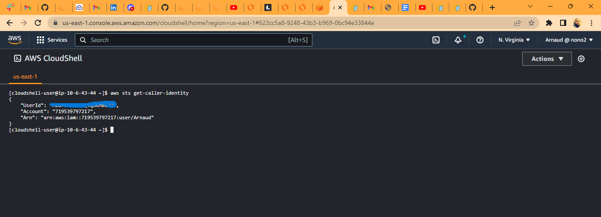
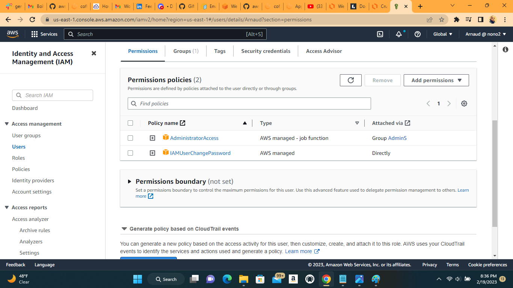

# Week 0 — Billing and Architecture

This week, the bootcamp starts on a good note introducing the application we will be working on. The importance of the security has been developped to help bootcampers not to expose their credentials and passwords. Which include setting, staying with budget. Above all we got understanding of the cruddur application and its componets that this journey will be on.

## Recreate logical diagram of cruddur application

Here I try to recreate the logical diagram of Cruddur and also annexe the link to properly view it in lucidchat here [https://lucid.app/lucidchart/45ce9325-a73c-42a2-99f0-2734aa390304/edit?viewport_loc=-3183%2C-3526%2C5068%2C2137%2C0_0&invitationId=inv_9b23c5fe-5dc1-4b30-b5b5-14d877ae7c23]

### Recreate Conceptual Diagram

I reproduced the conceptual diagram of Cruddur, which is used to communicate to shareholders.

#### Install and verify AWS CLI

Then I proceed to the environment setting in Gitpod to facilitate the relaunch of the work anytime I get back in this codespace.

Here I was able to commit it to the repository 

##### Creation of the Budget
Here I was able to create a budget in the console for the bootcamp for an amount of $15 just to see what it will be cost me monthly.

##### Creation of Billing alarm and SNS topic
Create a SNS topic for the billing alarm, which will send me a notification once the budget treshold is reached

While creating the SNS topic,I received the confirmation of my e-mail

###### Cloudshell launching

### Creation of IAM-user

Here I recreated another user, changed the password. Need to mention that because My initial user, mistankly. while working in the Gitpod got exposed. and after receiving messages from AWS, I quickly was able to desactive its policy and deleted that particular user. And also added a MFA to increase the security layer to not compromise my account.

Here is part of messages received from AWS when my first user's credentials were exposed to the public 

### Homework Challenges
