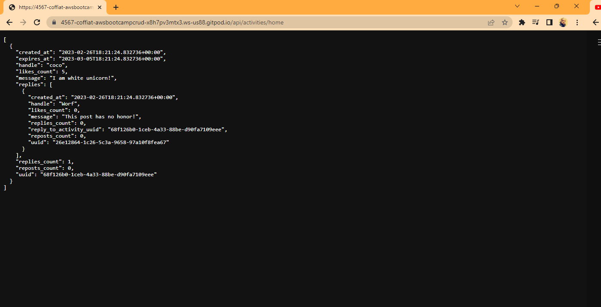

# Week 1 — App Containerization
After watching all the videos for week 1, I went ahead an start working  on this week  homework

## Required Homework

Backend-Flask image from dockerfile

Loading od docker-compose

Image of both ports opened

404 error message and internal server error message

After setting the environment variable, I was able to access the api-activities/home

Then I was able to test the frontend and the backend 

After modifications on the notifications, I was able to log in 

Updated gitpod yml file 

Launch all the containers

To get Postgres working I did the Database connection

Then I tried it and it is working

