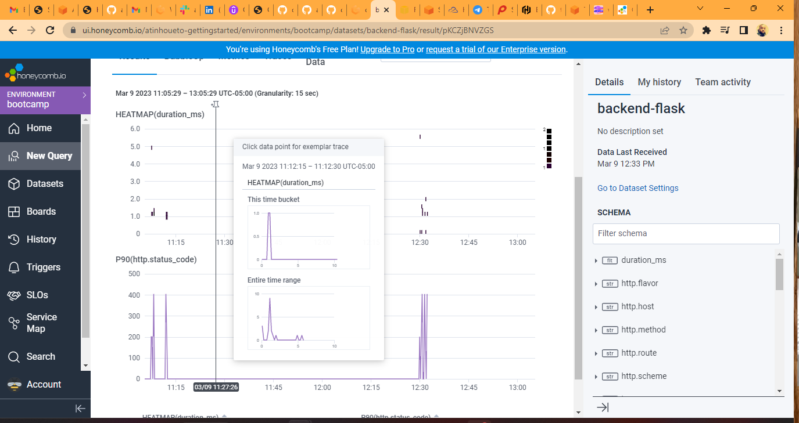
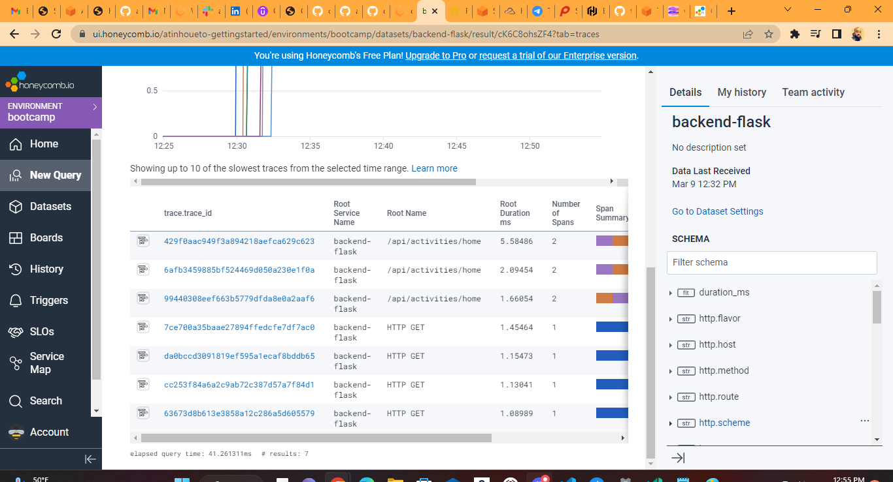
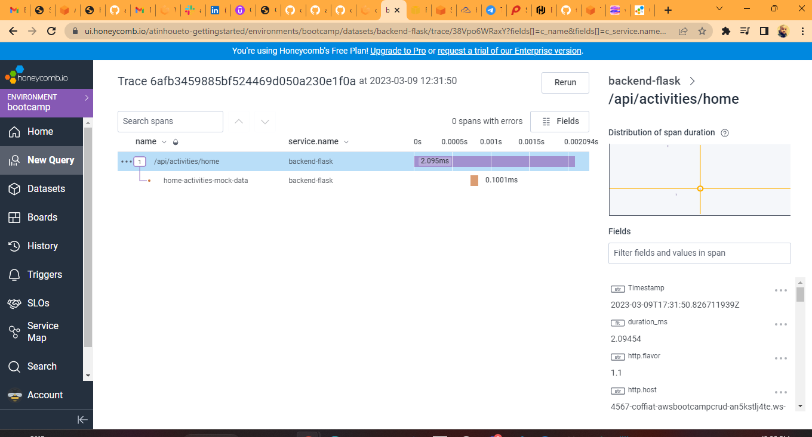
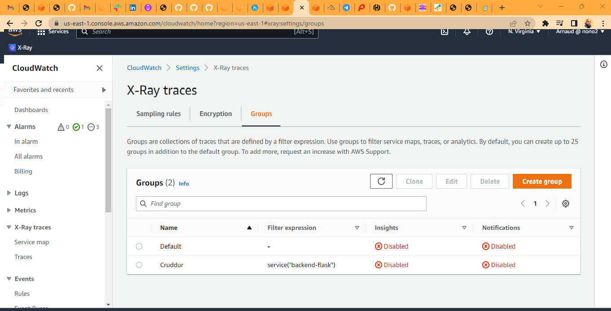
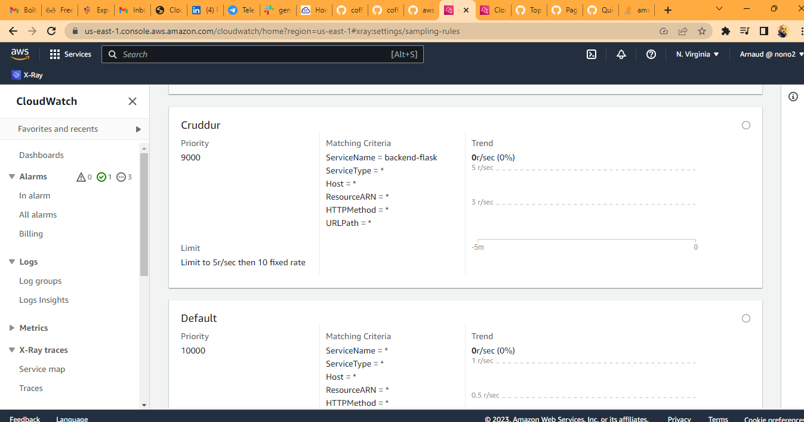
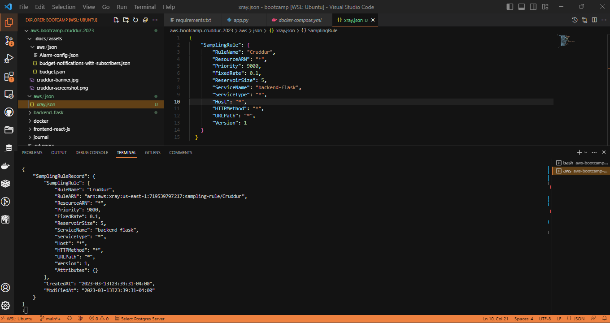
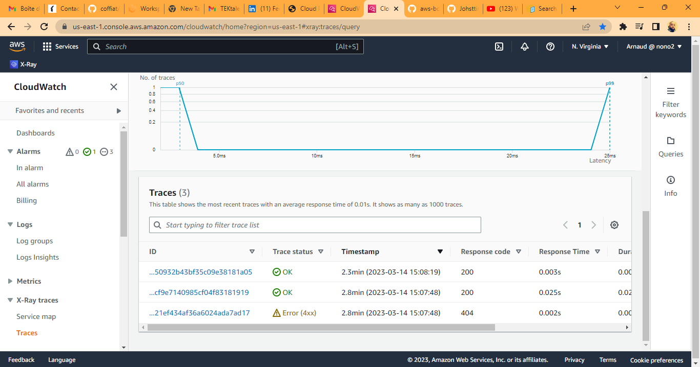
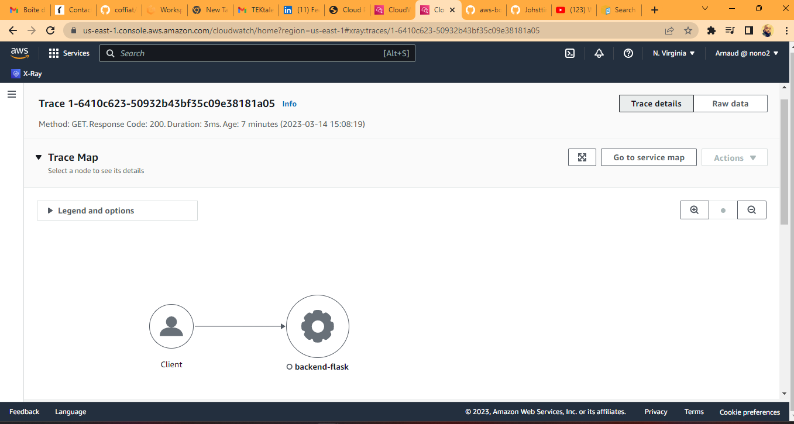
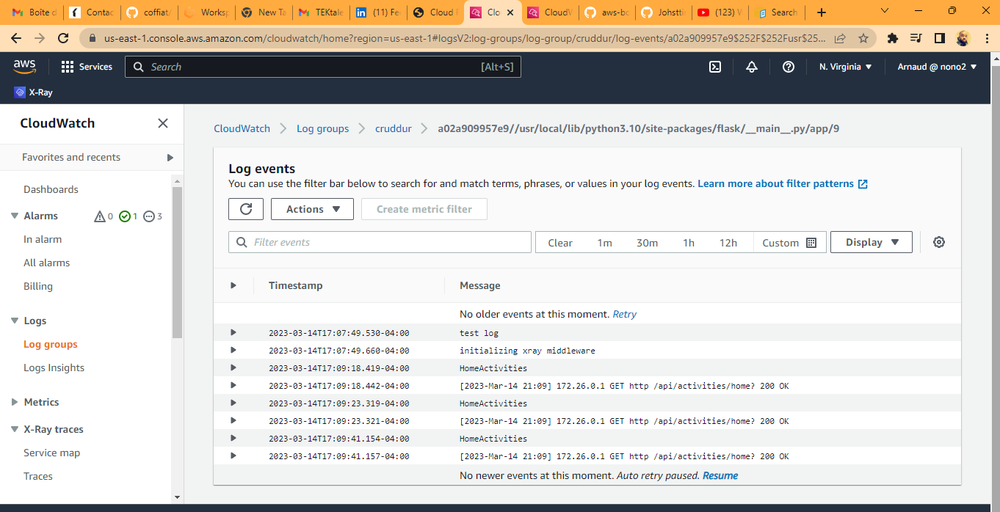
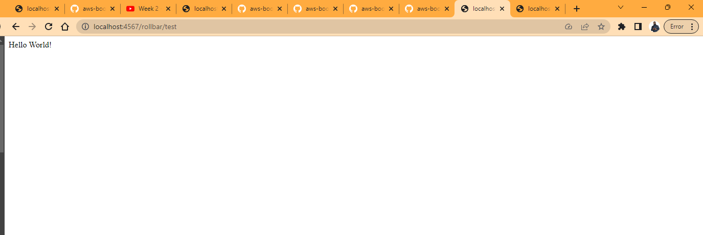

# Week 2 — Distributed Tracing 

This week has been challenging, but with determination, I manage to overcome them challenges.

## Requirement Homework

With HoneyComb, the documentation was pretty much straight forward

Here , I utilize x-ray 

Assets/cloudwatch-image.png

